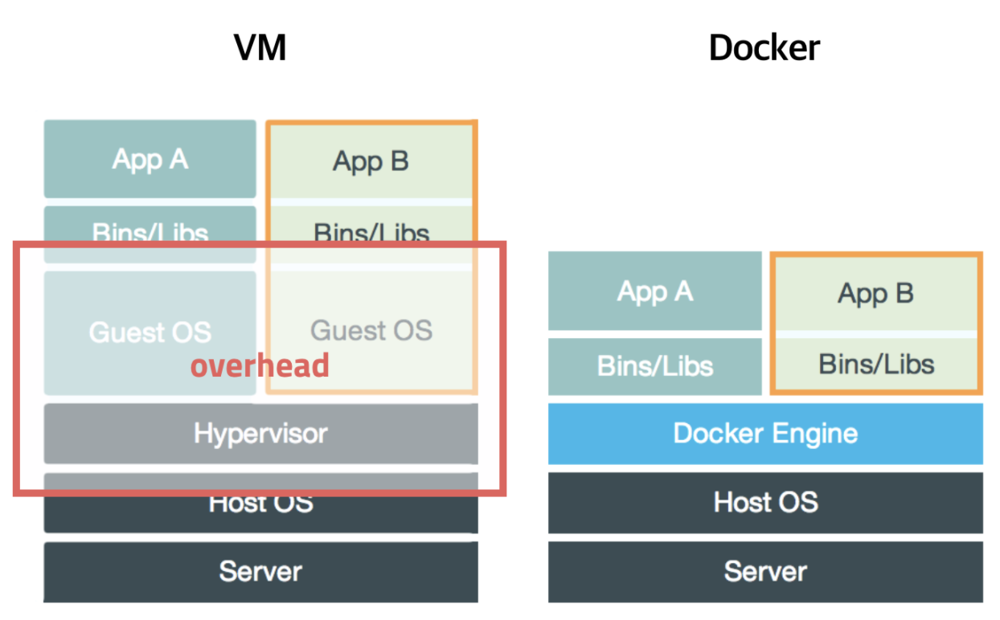
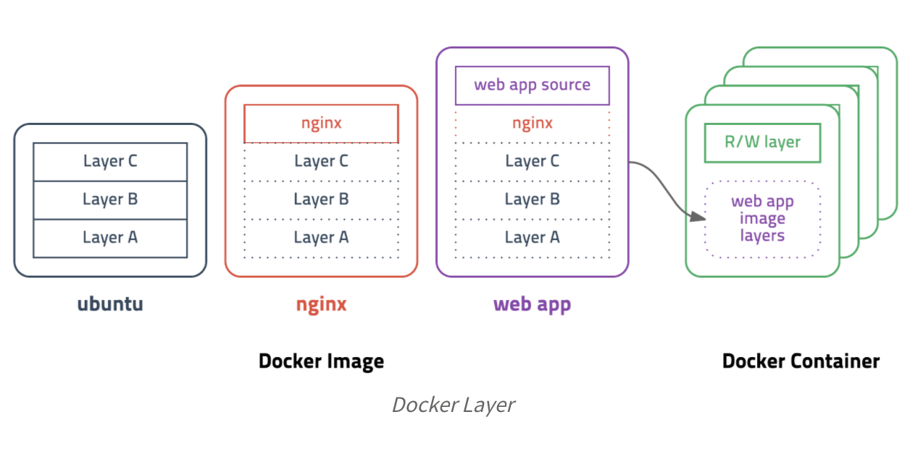

# 왜 도커를 써야 하나요?

- 눈송이 서버 (snowflake servers)
    - A 서버와 B 서버를 똑같이 구성하려고 노력했지만, 운영체제, 컴파일러, 패키지 버전, 코드 등에 차이가 생기면서 서로 모양이 다른 서버들이 생기는 상황
- Docker : 서버의 코드화
    - Dockerfile로 서버 운영 기록을 코드화하고, Dockerfile 을 빌드하여 docker image 를 생성해두면 서버가 구성되는 시점이 이미지를 만든 시점으로 고정된다.
    즉, 1년 전에 실행한 서버와 오늘 실행한 서버의 차이가 없게 된다.

        = 서버를 항상 똑같은 상태로 만들 수 있다!

    - docker image 로 도커 컨테이너를 생성해서 서버를 실행할 때, 환경 변수를 다르게 해야 하는 경우도 존재한다. (ex. 한 컴퓨터에서 도커 컨테이너를 2개 배포) 도커에서는 이런 부분을 환경 변수에 넣어 관리할 수 있다.

```
    도커 파일 == 서버 운영 기록 코드화
    도커 이미지 == 도커 파일 + 실행 시점 (immutable)
    도커 컨테이너 == 도커 이미지 + 환경 변수
```

    - 장점
        1. 서버 제작 과정에서 견고함과 유연성이 향상된다.
        2. 다른 사람이 만든 서버를 소프트웨어 사용하든 가져다 쓸 수 있다.
        3. 손쉽게 여러 서버를 배포할 수 있는 확장성이 보장된다.


# 도커는 무엇인가요?

- 컨테이너 기반의 오픈소스 가상화 플랫폼
- 가상화 기술
    - 물리적인 하드웨어 자원(CPU, memory) 등을 논리적인 리소스로 제공하기 위한 기술
    - 유형 : 하드웨어를 가상화 (ex. virtual machine) / 운영체제 수준의 가상화 (ex. LXC, docker)



- 리눅스 컨테이너 (LXC)
    - 운영체제 수준의 가상화 기술로, 리눅스 커널을 공유하면서 격리된 공간에서 프로세스가 동작하는 기술
    - 사용 기술 : 리눅스 namespace, control group, 루트 디렉터리 격리 등의 커널 기능을 이용
    - 특징
        1. 빠른 속도/효율성: 별도의 하드웨어 에뮬레이션 없이 리눅스 커널을 공유하므로 게스트 OS 관리가 필요하지 않아 매우 빠르고, 효율적이다.
        2. 높은 이식성: 리눅스 커널을 사용하고, 같은 컨테이너 런타임을 사용할 경우 컨테이너를 손쉽게 재현가능하다.
        3. stateless: 컨테이너 환경은 독립적이므로 다른 컨테이너에 영향을 주지 않는다.

- Docker
    - LXC 를 기반으로 시작해서 0.9버전에서는 자체적인 libcontainer 기술(LXC를 제어하는 API를 Go 언어로 구현한 기술)을 사용하였고 추후 runC기술에 합쳐졌습니다
    - 레이어 저장방식
        - 사용 기술 : overlay network, union file system
        - 도커는 layer라는 개념을 사용하고 유니온 파일 시스템(계층화된 파일 시스템)을 이용하여 여러개의 레이어를 하나의 파일시스템으로 사용할 수 있게 해준다.
            - 이미지는 여러개의 read-only 레이어로 구성되고 파일이 추가되거나 수정되면 새로운 레이어가 생성된다.
            - 컨테이너는 기존의 이미지 레이어 위에 read-write 레이어를 추가한다. 이미지 레이어를 그대로 사용하면서 컨테이너가 실행중에 생성하는 파일이나 변경된 내용은 read-write 레이어에 저장되므로 여러개의 컨테이너를 생성해도 최소한의 용량만 사용하여 효율적이다.

            


# 도커는 어떤 방식으로 쓰이나요?

- 서비스의 기능이 복잡하고 거대해질 수록 마이크로서비스 아키텍처(MSA)가 선호되고 있다.
- MSA는 여러 모듈을 독립된 형태로 구성한다. 따라서, MSA를 구현할 때 많은 컨테이너를 배포하여 관리하는 도커 기술이 많이 사용되고 있다.


# Reference

[왜 굳이 도커(컨테이너)를 써야 하나요? - 컨테이너를 사용해야 하는 이유](https://www.44bits.io/ko/post/why-should-i-use-docker-container)

[Docker란 ? VM과 차이, Docker 설치 및 기본 명령어를 중심으로](https://corona-world.tistory.com/15)

[리눅스 컨테이너란?](https://www.44bits.io/ko/keyword/linux-container#%EB%A6%AC%EB%88%85%EC%8A%A4-%EC%BB%A8%ED%85%8C%EC%9D%B4%EB%84%88%EB%9E%80)

[초보를 위한 도커 안내서 - 도커란 무엇인가?](https://subicura.com/2017/01/19/docker-guide-for-beginners-1.html)